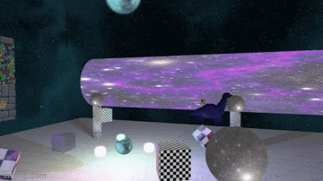
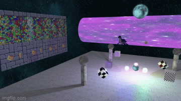
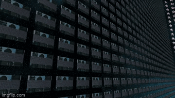
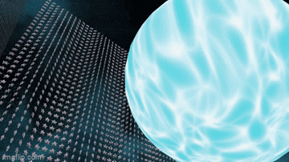
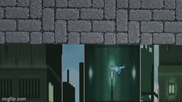
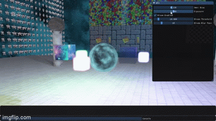
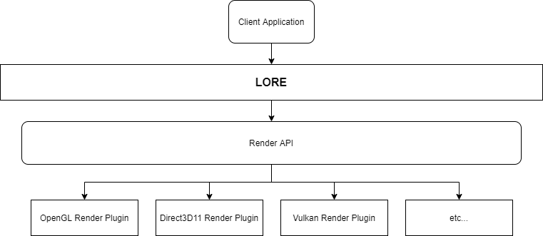

# LORE - Lightweight Object-oriented Rendering Engine

### **[Jump to Building](#building)**
### **[Jump to Architecture and Design](#architecture-and-design)**
### **[About OOP](#about-oop-1)**

## What is LORE?








LORE is a 2D and 3D rendering engine intended to provide an abstraction layer on graphics APIs, while also providing built-in shaders, rendering algorithms, and scene management, to name a few. I started this project to learn more about software architecture, graphics, and modern C++. My focus was more on engine architecture so the built-in graphics techniques are a bit out of date. It is also intended to be lightweight with minimal dependencies (hence the name).

### Engine Features
Scene graph, multiple scene rendering, graphics resource management, resource file management (parsing, indexing), dynamically loaded render API plugins, robust material/shading pipeline (easy to create custom effects), custom memory management (memory pooling), uber shader generation at runtime, data-driven configuration and scene loading, in-engine CLI, serialization API (currently JSON support with rapidJSON).

### Graphics Features
Realtime lighting (Blinn-Phong), render to texture, tangent space normal mapping, dynamic omnidirectional/directional shadow mapping, post processing (HDR with exposure based tone mapping, bloom), multitexturing, skyboxes, instancing, anti-aliasing, transparency, UI (powered by ImGui), model loading (with help from Assimp), forward 2D/3D renderer.

### Feature Wishlist (Basic)
Deferred renderer, parallelization, reflection probes, frustum culling, scene editing in-engine, gradient background/skybox, SSAO, grid.

### Feature Wishlist (Big Dreams)
Real graphics API backends like Vulkan and D3D12 render plugins :), PBR, better shadows (fix peter-panning, flickering), hybrid renderer (clustered forward/deferred).

## Building

I wanted an easy build process so there are just a few steps.

### Clone and initialize submodules
`git clone https://github.com/MemoryDealer/LORE.git`

`cd LORE`

`git submodule update --init --recursive`

### Generate the LORE project files and build
Navigate to `src` and run `generate_project.bat` to generate the Visual Studio project files using Premake.

Open `LORE.sln` and build the solution (you probably want the release build for good performance).

(Note I have provided the lib/dll files for the external libraries in the `lib` directory for convenience).

You are done :)

### Running the samples

By default the `Sample3D` project is selected. There is also the `Sample2D` project, and the unit tests.

## Tips and Tricks

### Debug UI
Press `~` to bring up the debug UI and console. Alternatively you can only display the performance stats with `shift + ~`. There are just a few options in the debug UI currently.



#### Some Console Commands (not case sensitive):
- `SetNodePos [node name] [x],[y],[z]`: sets the position of a node in world space
- `MoveNode [node name] [x],[y],[z]`: translates node in world space
- `SetLightColor [node name] [r],[g],[b]`: changes a light's color

Scene node names for `Sample3D` can be found in `LORE\res\Sample3D\Sample3D.scene` and in the `Game.cpp` files for `Sample2D`.

E.g.,
```
"Layout": {
    "Nodes": {
      "MagicSphere": {
        "Prefab": "MagicSphere",
        "Position": [0.0, 3.0, 0.0],
        "ChildNodes": {
          "RedCube": {
            "Prefab": "GlowingRedCube",
            "Light": "LightRed",
            "Scale": 0.25
          },
```
"MagicSphere" and "RedCube" are a couple of node names.

### 2D Sample Controls 
- Move with standard WASD
- Z/X to zoom camera in/out

### 3D Sample Controls
- Move camera with standard WASD
- Mouse to rotate camera
- Q/E to move up/down in world space
- Shift to speed up movement
- Arrow keys move the player in the 2D scene

## Bonus Image(s)

2D scene with light colors changed (e.g., `setlightcolor torch0 [r],[g],[b]`):


<br/>

# Architecture and Design

The main idea of setting up rendering in LORE is using a `RenderView`, which sets up a scene, camera, and viewport dimensions. By using two of these, it's very easy to setup an offscreen scene and sample it in the main scene (as seen in the 3D sample, where the 2D sample is rendered inside of it).

The provided samples showcase how to setup the main LORE objects (The `Context` - the object that manages everything, a `Scene`, and a `Camera`, etc.),  how to load resources, and render the scene.

The client application/game is dynamically linked to the LORE library, which itself dynamically loads the shared library (DLL) of the desired render plugin. The render plugin API calls are all abstracted behind the LORE API frontend.



## Objects (the major ones)

Most engine objects used for rendering derive from the `Alloc<T>` class which allows their memory to be managed and pooled, to achieve constant time creation/destruction. The `MemoryPool<T>` class manages this process.

### **Prefab**
Contains all of the information neeed to render an object, which includes:
- The model (e.g., a cube, a quad, or a custom mesh)
- The material (how it will look)
- Instancing settings (enable instancing on a prefab to render huge amounts of objects with little overhead)
- Options such as shadow casting and culling mode

### **Material**
Everything describing the appearance of a model, including:
- Color settings (ambient, diffuse, specular)
- Opacity (implies transparency)
- The `GPUProgram` used to render the model
- The `Sprite` to be rendered on the model

### **Renderer**
The base class for presenting scene content (e.g., from a `RenderView`) to the window. LORE provides built-in renderer classes for forward 2D and 3D rendering algorithms, which coincide with the built-in generated stock shaders.

### **SceneGraphVisitor**
Responsible for traversing and updating the scene graph when presenting a scene from a `RenderView`. Looks into each node and adds its renderable information (prefabs, lights, etc.) to the renderer queues.

### **Sprite**
Contains `Texture` objects, each separated based on their type (diffuse, normal, or specular maps). The `Sprite` can contain N number of texture objects for each type for multitexturing.

### **SpriteController**
Used for animating sprites by specifying frames and timing information.

### **Shaders**
LORE comes with a built-in shader generator, which creates and compiles standard shaders at runtime based on a set of parameters. These are used in the default pipeline (the forward 2D/3D renderers). See `StockResource.cpp` for the shader generation.

Custom shaders can also be created by the client, for an example see `Shaders.cpp` in the Sample3D demo.

### **GPUProgram**
Container for `Shader` objects which are compiled, linked, and ready to render.

### **Window**
Manages the OS window setup for rendering. Contains a `ResourceController` for all resources intended for rendering in the window. Also maintains its `RenderView` objects which are used to present the scene content as intended by the client.

### **ResourceController**
The central hub for managing resources for rendering. Everything that is loaded (models, textures, GPU programs, render targets, prefabs, etc.) is accessible via its ID (a string) through here. Each resource is also loaded into a specific resource group, making it easy to load/unload collections of resources.

All resources are managed with templated functions/classes.

### **Registry**
A key part of managing the resources - a templated class for storing objects in the container type specified at compile time. Provides iterators to access the data as well as ID (string) based accessors.

### **RenderTarget**
Sets up everything needed for rendering to a target (a texture, e.g., an OpenGL framebuffer). These are used for rendering to textures, shadow map rendering, and post processing.

### **Scene**
Container of information for rendering content, such as:
- Scene nodes
- Lights
- Renderer

It is used in a `RenderView` along with a camera and viewport to display content.

### **Node**
The key component of a `Scene` and the scene graph. Renderable objects can be attached to it (such as prefabs and lights). Can contain any number of child nodes recursively, which are automatically updated based on their inherited transforms.

### **Model**
The top-level object for loading/rendering a 3D model. Contains multiple `Mesh` objects which are rendered individually as part of the model.

### **Light**
Provides lighting information to add to the scene (if attached to a node). Currently point and directional lights are supported (with shadows).

### **Camera**
The base class for 2D and 3D camera objects, which are part of a `RenderView`.

### **SceneLoader**
Processes JSON files to load a scene layout (including prefabs, skybox settings, and nodes) into memory. Avoids having to manually setup a scene in code.

### **ResourceFileProcessor**
Part of the scene loading process - knows how to interpret resource files based on their type (textures, models, LORE sprite metadata files, etc.).

### **Serializer**
An interface for reading/writing data with a configurable backend (e.g., text or memory). Currently supports JSON data format through rapidJSON.

### **InputController**
Allows you to setup input callbacks (keyboard/mouse). You can also temporarily override input handling with `InputHooks` through the static methods in the `Input` class. This is useful for UIs (it is used in the debug UI).

---
<br />

### About OOP
#### **I do not condone object-oriented programming as The Way™ of developing software. This project was partially an experiment in OOP.**

#### I recommend [this video](https://www.youtube.com/watch?v=QM1iUe6IofM) on the topic of OOP.
<br/>

### Feel free to submit pull requests or issues, however my time is mostly dedicated to other projects now, as this was a side project just for fun :)

