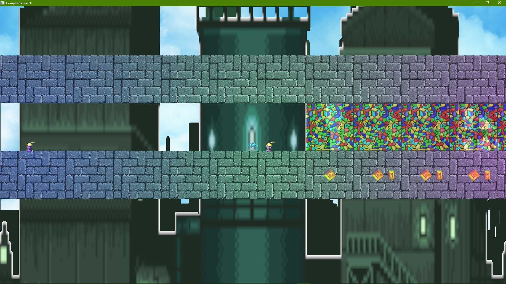
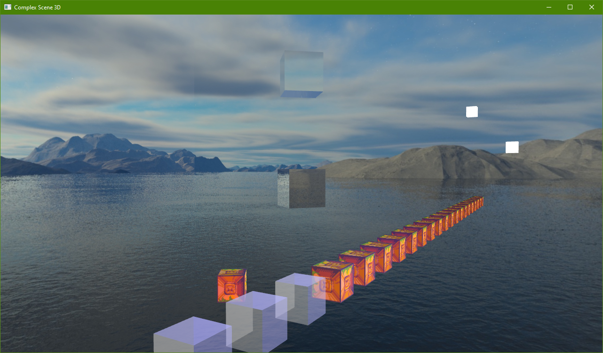

# LORE - Lightweight Object-oriented Rendering Engine

## Build Instructions (Windows)

### Initialize submodules (from the root directory):

`git submodule update --init --recursive`

### Build assimp, first you will need to install CMake and run the following commands:

`cd src/External/assimp`

`cmake CMakeLists.txt`

Then build the project "assimp" inside the Assimp Visual Studio solution or by command line.

### Generate the LORE project files and build
We can go up one directory and run `make.bat` to generate the Visual Studio project files using Premake.

Open the solution (you may have to upgrade if using VS 2019), and build all.

You are done :)

### Running the samples

By default the `Demo3D` project is selected. There are also two other projects: `Example_ComplexScene2D` and `Example_ComplexScene3D`.

#### Note about sample resource files

The resource files under the `res` directory are copied to the executable directory (e.g., `bin/Debug/Run`) as part of the build process. Any changes under the `res` directory require either running `res/copyToBin.bat` or building one of the projects again (except for `Tests` or `glad`).

Alternatively, you can change the debugging working directory to `..\..\..` to avoid needing the copy (in Visual Studio, right-click sample project -> properties and go to the Debugging section to change the Working Directory).

## Tips and Tricks

### Debug Console
Press shift and ~ to bring up the debug console (also brings up the FPS display which can be toggled alternatively with ~).

#### Some Commands (not case sensitive):
- `SetNodePos [node name] [x],[y],[z]`: sets the position of a node in world space
- `MoveNode [node name] [x],[y],[z]`: translates node in world space
- `SetLightColor [node name] [r],[g],[b]`: changes a light's color
- `Reload`: reloads the scene (if loaded from file)

Scene node names for `Demo3D` can be found in `LORE\res\Demo3D\Demo3D.scene` and in the `Game.cpp` files for the complex scene projects.

E.g.,
```
  "Layout": {
    "Nodes": {
      "FloatingLight": {
        "Entity": "Light",
        "Light": "PointLight0", <-- name to use for SetLightColor
        "Position": [0.0, 3.5, 0.0],
        "Scale": 0.25
      },
      "Star": {
        "Entity": "Star",
        "Position": [0.0, 0.0, -8.0],
        "Scale": 0.2
      }
    }
  }
```

### 2D Sample Controls 
- Move with standard WASD
- Z/X to zoom camera in/out

### 3D Sample Controls
- Move camera with standard WASD
- Mouse to rotate camera
- Q/E to move up/down in world space
- Shift to speed up movement (`Demo3D` only)

## Images

2D scene with light colors changed (e.g., `setlightcolor torch0 [r],[g],[b]`):


A 3D scene:


## Known Issues
- Reloading in Demo3D leaves out the wood floor
- 3D skybox does not automatically track the camera position, so you can fly freely outside of it

